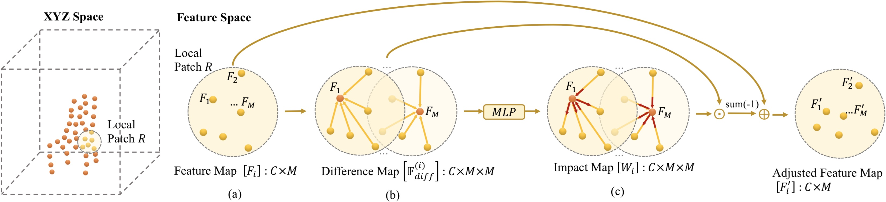

# PointWeb: Enhancing Local Neighborhood Features for Point Cloud Processing

by Hengshuang Zhao\*, Li Jiang*, Chi-Wing Fu, and Jiaya Jia, details are in [paper](http://openaccess.thecvf.com/content_CVPR_2019/papers/Zhao_PointWeb_Enhancing_Local_Neighborhood_Features_for_Point_Cloud_Processing_CVPR_2019_paper.pdft).

### Introduction

This repository is build for PointWeb in point cloud scene understanding.



### Usage

1. Requirement:

   - Hardware: 4 GPUs (better with >=11G GPU memory)
   - Software: PyTorch>=1.0.0, Python3, CUDA 9.0 [tensorboardX](https://github.com/lanpa/tensorboardX)

2. Clone the repository and build the ops:

   ```shell
   git clone https://github.com/hszhao/PointWeb.git
   cd lib/pointops && python setup.py install && cd ../../
   ```

3. Train:

   - Download related datasets and modify the relevant paths specified in folder `config`.

   - Specify the gpu used in config and then do training:

     ```shell
     sh tool/train.sh s3dis pointweb
     ```

4. Test:

   - Download trained segmentation models and put them under folder specified in config or modify the specified paths.

   - For full testing (get listed performance):

     ```shell
     sh tool/test.sh s3dis pointweb
     ```

5. Visualization: [tensorboardX](https://github.com/lanpa/tensorboardX) incorporated for better visualization.

   ```shell
   tensorboard --logdir=run1:$EXP1,run2:$EXP2 --port=6789
   ```

6. Other:

   - Resources: GoogleDrive [LINK](https://drive.google.com/open?id=1IFoKe5TM3ZO38LT4VXCaHKvCNkXfgtBf) contains shared models, predictions and part of the related datasets.
   - Video predictions: Youtube [LINK](https://youtu.be/CaobqpsUP_4).

### Performance

Description: **mIoU/mAcc/aAcc/voxAcc** stands for mean IoU, mean accuracy of each class, all pixel accuracy , and voxel label accuracy respectively. 

mIoU/mAcc/aAcc of PointWeb on S3DIS dataset: 0.6055/0.6682/0.8658.

mIoU/mAcc/aAcc/voxAcc of PointWeb on ScanNet dataset: 0.5063/0.6061/0.8529/0.8568.

### Citation

If you find the code or trained models useful, please consider citing:

```
@inproceedings{zhao2019pointweb,
  title={{PointWeb}: Enhancing Local Neighborhood Features for Point Cloud Processing},
  author={Zhao, Hengshuang and Jiang, Li and Fu, Chi-Wing and Jia, Jiaya},
  booktitle={CVPR},
  year={2019}
}
```
